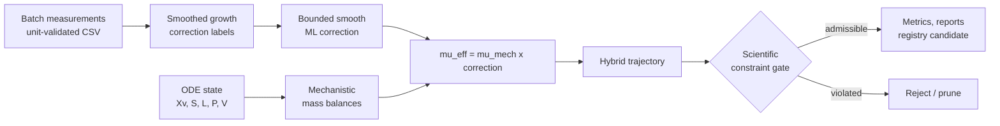
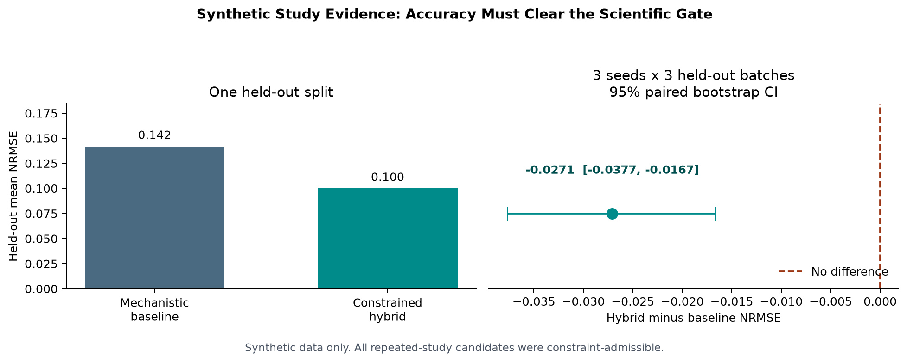

# hybrid-bioprocess-lab

[](https://github.com/lynchaos/hybrid-bioprocess-lab/actions/workflows/ci.yml)

An applied scientific-ML portfolio project: a constrained hybrid model for a
fed-batch mammalian cell culture, built with the research and production
discipline needed to make model claims inspectable.

The domain is a fed-batch mammalian cell culture. The scientific question is:
how do you add a data-driven layer to a mechanistic bioprocess model without
letting it quietly violate mass balances, produce lactate from nowhere, or
learn assay noise as if it were biology?

The engineering question is: how do you wrap that model in the tooling a real
ML team uses — Flyte, MLflow, Optuna, Ray Tune, packaging, CI, and a clean
inference path — while keeping the science legible?

This repo is an answer to both.

> **Scope:** all reported outcomes use a synthetic fed-batch plant. They
> demonstrate method design and reproducibility, not industrial process
> validation or readiness for process decisions.

## At a glance

| Question | What this repository demonstrates |
|---|---|
| Where does ML belong? | A bounded, smooth correction to the specific growth rate, not unconstrained state derivatives. |
| What stops implausible models? | Constraints are hard promotion and selection gates, not a penalty in an accuracy objective. |
| Is the result repeatable? | Whole-batch splits, predeclared seeds, and paired bootstrap confidence intervals. |
| Can it leave a notebook? | Package API, CLI, saved-model inference, MLflow registration, lineage artifacts, reports, Docker, and CI. |
| What remains unknown? | Performance, calibration, and safety on external real batches. |

## Model architecture



---

## What is inside

| Layer | Files | Purpose |
|-------|-------|---------|
| Mechanistic core | `src/hybridbio/mechanistic.py` | Monod-type ODE for Xv, S, L, P, V |
| Data-driven correction | `src/hybridbio/corrections.py`, `torch_correction.py` | Bounded growth-rate multiplier behind a `Protocol` |
| Hybrid composition | `src/hybridbio/hybrid.py` | Wires mechanism + correction together |
| Scientific constraints | `src/hybridbio/constraints.py` | Non-negotiable biology/physics checks |
| Training | `src/hybridbio/training.py`, `rollout.py` | One-step and rollout training |
| Evaluation | `src/hybridbio/evaluation.py` | Metrics + admissibility, co-equal |
| Data contract | `src/hybridbio/ingestion.py` | Unit-explicit CSV validation before modeling |
| Research studies | `src/hybridbio/study.py`, `uncertainty.py` | Repeated seeds, batch bootstrap CIs, trajectory intervals |
| Pure-ML comparator | `src/hybridbio/pure_ml.py` | Direct trajectory benchmark with no mechanistic state evolution |
| Lineage and audit | `src/hybridbio/lineage.py`, `audit.py` | Versioned split/provenance record and correction sensitivity diagnostics |
| Inference | `src/hybridbio/inference.py` | Load a saved model and predict trajectories |
| Reporting | `src/hybridbio/reporting.py` | Markdown/HTML reports for scientists and CI |
| Registry | `src/hybridbio/registry.py` | MLflow model registry with validation gate |
| Workflows | `workflows/` | Flyte, Optuna, and Ray Tune examples |
| CLI | `src/hybridbio/cli.py` | `hybridbio train | predict | sweep` |

---

## Design decisions

### The learned correction is a bounded multiplier on growth rate

```
mu_eff = mu_mech(S, L) * correction(features)
```

Why this seam:
- Mass balances stay structurally safe.
- The learned object is a curve a scientist can inspect and reject.
- It is narrow enough that swapping sklearn ↔ PyTorch is one new file.

### Admissibility is a gate, not a metric

A model passes only if it is accurate **and** satisfies scientific constraints.
The gate has teeth in four places:
1. `EvaluationReport.passed`
2. `tests/test_scientific_constraints.py` (injects a 3× rogue correction)
3. Flyte `validation_gate` task (fails the DAG)
4. Optuna/Ray Tune pruning (inadmissible trials are rejected, not penalised)

### Smoothness matters inside an ODE

The default correction is a smooth MLP. Tree ensembles are kept as a
documented warning: their discontinuities make adaptive ODE solvers hang.

### Train/serve skew is avoided deliberately

- Feature contract is versioned (`FEATURE_VERSION`, `FEATURE_NAMES`).
- Point features used inside the ODE are tested to match batch features used in
  training.
- Rollout training closes the feedback loop by training on simulated trajectories.

---

## Quick start

```bash
# Clone and enter the repo
cd hybrid-bioprocess-lab

# Create a virtual environment (optional but recommended)
python3.11 -m venv .venv
source .venv/bin/activate

# Install the base package
pip install -e .

# Install with all extras for development
pip install -e ".[tracking,torch,ray,dev]"
```

### Run tests

```bash
pytest
```

Tests are split by concern:
- `test_mechanistic.py` — ODE, kinetics, mass balances
- `test_scientific_constraints.py` — biology/physics guardrails
- `test_regression.py` — golden values and feature contracts
- `test_torch_correction.py` — PyTorch correction model
- `test_inference.py` — saved model loading and prediction
- `test_registry.py` — MLflow registry integration
- `test_rollout.py` — rollout training
- `test_reporting.py` — report generation
- `test_ingestion.py` — CSV units and data-contract failures
- `test_study.py` — repeated-study and paired-bootstrap behavior
- `test_uncertainty.py` — batch-bootstrap trajectory intervals
- `test_lineage.py`, `test_audit.py` — reproducibility records and correction diagnostics
- `test_cli.py` — saved CLI artifacts and reports
- `test_flyte_workflow.py`, `test_flyte_workflow_tasks.py` — promotion rules and executable Flyte task paths

The local suite contains 74 tests. GitHub Actions validates quality across
Python 3.11 and 3.12, then runs a Docker CLI smoke test.

### Train and save a model from the CLI

```bash
hybridbio train --out-dir ./models/run-001 --n-batches 24 --n-test 6 --report report.md
```

Each training artifact includes `manifest.json`: source/split batch IDs,
feature version, kinetic parameters, training configuration, candidate and
baseline metrics, scientific-gate decision, Git revision, Python version, and
package version. The requested report includes the same lineage section plus a
local 10th-to-90th percentile correction-sensitivity table. Those effects are
diagnostics for review, not causal claims about correlated process variables.

Use the PyTorch backend:

```bash
hybridbio train --out-dir ./models/run-torch --backend torch --report report.md
```

### Predict from a saved model

```bash
hybridbio predict --model ./models/run-001 --report prediction-report.md
```

### Run an Optuna sweep

```bash
hybridbio sweep --trials 30 --report sweep-report.md
```

### Run the Flyte workflow locally

```bash
pyflyte run workflows/flyte_training.py train_hybrid_wf --n_batches 24
```

### Run the Ray Tune sweep

```bash
python workflows/ray_tune_sweep.py --trials 30
```

## Synthetic Study Evidence



This graphic is generated from the public package by
[`scripts/generate_readme_visuals.py`](scripts/generate_readme_visuals.py), not
hand-authored. In the deterministic checked-in experiment:

- One held-out split improves mean NRMSE from **0.1419** for the mechanistic
  baseline to **0.1000** for the constrained hybrid.
- Across three predeclared seeds and three held-out batches per seed, the paired
  hybrid-minus-baseline NRMSE is **-0.0271** with a 95% bootstrap interval of
  **[-0.0377, -0.0167]**.
- All repeated-study candidates passed the scientific constraint gate.

The repository distinguishes a single model run from evidence. `study.py`
repeats held-out, batch-level comparisons over predeclared seeds and reports a
paired bootstrap confidence interval for the hybrid-minus-mechanistic NRMSE.
A result is called an improvement only when every run is scientifically
admissible and the interval is strictly below zero.

The same study trains a direct multi-output pure-ML trajectory comparator from
only initial conditions, feed settings, and time. It is evaluated on exactly
the same held-out batches and through the same scientific gate. This keeps the
comparison fair while making the value of the mechanistic structure visible:
an accurate direct trajectory fit is still rejected if it violates process
constraints.

The Flyte workflow now writes that same model-plus-manifest artifact before
calling the gated `log_and_register()` MLflow path. A failing scientific gate
or non-improving candidate cannot reach registration; both failure modes have
direct regression coverage. The local workflow output directory is an
explicit handoff point for a Flyte object-store artifact in a deployed
environment, rather than a claim that this synthetic example already operates
on a production platform.

```python
from hybridbio import StudyConfig, run_repeated_study

result = run_repeated_study(StudyConfig(seeds=(7, 17, 29, 43, 59)))
print(result.nrmse_delta)
print(result.candidate_improves)
```

`uncertainty.py` trains a bootstrap ensemble by resampling whole batches,
then returns trajectory quantiles and empirical held-out coverage. The
intervals describe uncertainty from the available synthetic training batches;
they are **not** operational prediction guarantees. Calibration on external,
real batches is required before using them for process decisions. The initial
all-state empirical coverage is **37.9%**, intentionally shown as a calibration
gap rather than hidden behind an uncertainty label.

Regenerate the checked-in evidence visual with:

```bash
python scripts/generate_readme_visuals.py
```

For the required CSV column names, physical units, and validation policy, see
[docs/data-contract.md](docs/data-contract.md). No missing values are silently
imputed at this boundary.

The full reproducible study walkthrough, including held-out trajectories and
bootstrap intervals, is in
[notebooks/hybrid_bioprocess_analysis.ipynb](notebooks/hybrid_bioprocess_analysis.ipynb).

---

## Docker

```bash
docker build -t hybridbio:latest .
docker run --rm hybridbio:latest train --out-dir /tmp/model --n-batches 8 --n-test 2
```

---

## Project structure

```
hybrid-bioprocess-lab/
├── src/hybridbio/          # Package source
├── tests/                  # Pytest suite
├── workflows/              # Flyte, Optuna, Ray Tune
├── notebooks/              # Exploratory notebook
├── docs/                   # Public data contract, learning log, and visuals
├── Dockerfile
├── pyproject.toml
└── .github/workflows/ci.yml
```

---

## Optional dependency groups

| Group | Install | Includes |
|-------|---------|----------|
| Base | `pip install -e .` | numpy, scipy, scikit-learn, joblib |
| Tracking | `pip install -e ".[tracking]"` | mlflow, optuna |
| Orchestration | `pip install -e ".[orchestration]"` | flytekit |
| Torch | `pip install -e ".[torch]"` | torch |
| Ray | `pip install -e ".[ray]"` | ray[tune] |
| Dev | `pip install -e ".[dev]"` | pytest, pytest-cov, ruff, mypy |

---

## Why this repo exists

See `docs/LEARNING_LOG.md` for the running notes: the mistakes, the fixes, and
the lessons. It is the most honest part of the project.

## Next validation milestones

1. Evaluate against versioned real process batches from distinct operating regimes.
2. Calibrate bootstrap intervals and define decision thresholds with process experts.
3. Replace the local Flyte handoff directory with a versioned remote artifact store and human approval policy.
4. Define monitored inference SLOs and drift thresholds with process experts before any process-facing use.

---

## License

See `LICENSE`.
